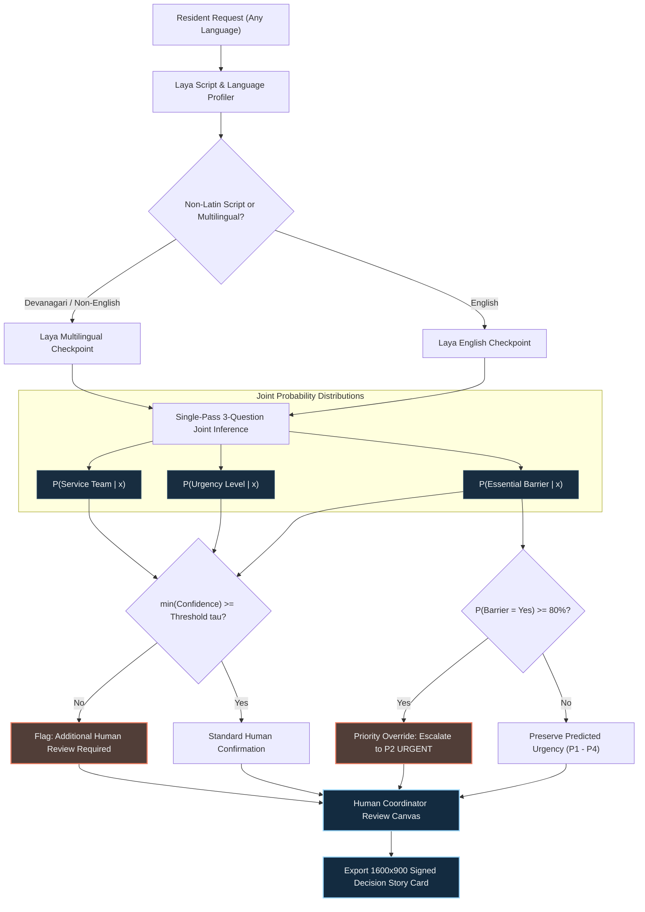
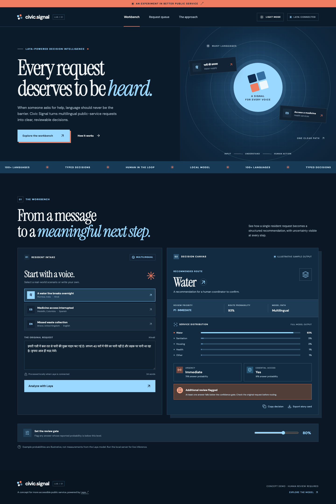

<div align="center">


# Civic Signal

### 🏛️ When someone asks for help, language should never be the barrier. Every request deserves to be heard.

[](https://python.org)
[](https://react.dev)
[](https://vitejs.dev)
[](https://huggingface.co/convaiinnovations/laya)
[](LICENSE)
[](#-verification-and-production-audit)

<p align="center">
  <a href="#-overview"><strong>Overview</strong></a> •
  <a href="#-interactive-workbench"><strong>Workbench</strong></a> •
  <a href="#-quickstart"><strong>Quickstart</strong></a> •
  <a href="#-how-it-works"><strong>How It Works</strong></a> •
  <a href="#-mathematical-formulation--safety-gates"><strong>Safety Gates</strong></a> •
  <a href="#-architecture"><strong>Architecture</strong></a> •
  <a href="#-civic-trust--boundaries"><strong>Civic Trust</strong></a> •
  <a href="#-verification-and-production-audit"><strong>Audit</strong></a>
</p>

</div>

---

## ⚡ Overview

> _“हमारी गली में कल रात से पानी की मुख्य पाइप फट गई है। लगभग 40 घरों में पीने का पानी नहीं है...”_  
> *(The main water pipe burst last night. 40 homes have no drinking water...)*

In public administration, automated workflows too often collapse ambiguous, distressed human language into rigid black-box categorizations. A resident's urgent plea in Spanish, Hindi, Arabic, or Tagalog gets lost in translation or routed to the wrong municipal department.

**Civic Signal** is a human-centred, multilingual decision intelligence workbench powered by [Laya](https://huggingface.co/convaiinnovations/laya) — an open decision model that maps unstructured resident language into **typed decision distributions** in a single inference pass.

Rather than generating speculative prose or automating dispatch behind closed doors, Civic Signal makes **model uncertainty visible** to municipal coordinators:

1. **Native Multilingual Routing**: Dynamically detects script and language to route requests between English and 100+ language checkpoints.
2. **Typed Multi-Axis Decisions**: Solves three orthogonal questions simultaneously: **Service Team**, **Urgency Level**, and **Essential-Service Access Barrier**.
3. **Inspectable Uncertainty**: Renders the complete probability distribution across all candidate classes, revealing close calls and model doubt.
4. **Configurable Confidence Gates**: An interactive threshold $\tau$ flags low-confidence predictions for mandatory human verification.
5. **Deterministic Safety Escalation**: A transparent safety rule guarantees that any confirmed barrier to essential survival services (water, shelter, healthcare) elevates the review priority to **Urgent**, regardless of model hesitancy.
6. **Zero-Knowledge Privacy**: Inference runs 100% locally on your machine. Request bodies are never persisted, logged, or sent to external APIs.

---



---

## 🖥️ Interactive Workbench

Civic Signal features a local visual workbench with smooth canvas-driven orbital radar animations, real-time threshold sliders, interactive intake scenarios, and dark/light mode persistence:

|                                🌙 Dark Mode (Editorial Navy)                                 |                             ☀️ Light Mode (Warm Minimal)                             |
| :------------------------------------------------------------------------------------------: | :----------------------------------------------------------------------------------: |
| [](docs/workbench-dark.png) | [](docs/workbench-light.png) |

> [!TIP]
> **Dynamic Beacon Physics:** Moving your pointer across the hero casts an interactive atmospheric beacon that refracts across orbital lines, tracking pointer coordinates (`--mx`, `--my`) with fluid easing and automatic reduced-motion accessibility overrides.

---

## 🚀 Quickstart

### Prerequisites
- **Node.js**: v20 or v22+
- **Python**: 3.10, 3.11, or 3.12

### 1. Clone & Install

```bash
# Clone the repository
git clone https://github.com/satiricalguru/Civic-Signal.git
cd Civic-Signal

# Setup Python virtual environment & dependencies
python3.12 -m venv .venv
source .venv/bin/activate
pip install -r requirements.txt

# Install frontend dependencies
npm install
```

### 2. Start the Backend API (Local Laya Bridge)

```bash
USE_TF=0 .venv/bin/python server.py
```
*The local bridge starts on `http://127.0.0.1:8000`. On your first live query, Laya downloads the designated lightweight checkpoint from Hugging Face and caches it locally.*

### 3. Launch the Interactive Workbench

In a second terminal window:

```bash
npm run dev
```

Open **[http://localhost:5173](http://localhost:5173)** in your browser.

- **Illustrative Mode**: Works immediately out of the box with zero model setup. Pre-loaded scenarios (Mumbai water line burst in Hindi, Medellín pharmacy outage in Spanish, Bristol sanitation failure in English) let you explore confidence distributions and safety gate dynamics instantaneously.
- **Live Local Inference**: Type or paste any resident message in any language into the intake textarea and click **Analyze with Laya**. The local Python bridge executes live forward-pass inference and streams exact model probabilities directly into the workbench.
- **Export Story Card**: Click **Export story card** to generate a 1600 × 900 PNG report complete with case title, language detected, predicted routes, and validation provenance.

---

## 🔬 How It Works

### The Decision Formulation

For a resident submission $x \in \mathcal{X}$ composed of natural language text in arbitrary script:

1. **Script & Language Routing**:
   $$\mathcal{M}^* = \begin{cases} \text{multilingual}, & \text{if } \text{DiacriticRate}(x) > 0 \lor \text{NonLatinFraction}(x) > 0 \\ \text{english}, & \text{otherwise} \end{cases}$$

2. **Single-Pass Multi-Question Likelihood**:
   The model evaluates three orthogonal categorical questions $\mathcal{Q} = \{\text{service}, \text{urgency}, \text{access}\}$:
   $$\hat{y}_q = \arg\max_{c \in \mathcal{C}_q} P(q = c \mid x, \mathcal{M}^*)$$
   where the answer confidence is defined as:
   $$C_q(x) = \max_{c \in \mathcal{C}_q} P(q = c \mid x)$$

3. **The Confidence Review Gate ($\tau$)**:
   Given an operator-tunable safety tolerance $\tau \in [0.50, 0.95]$ (default $\tau = 0.80$):
   $$\text{Gated}(x) = \mathbb{I}\left[\min_{q \in \mathcal{Q}} C_q(x) < \tau\right]$$
   If any question falls below the threshold, the system triggers **"Additional review flagged"**, alerting coordinators to scrutinize the raw intake text.

4. **The Essential-Service Priority Escalation Rule**:
   Even if the statistical model scores a request as low or moderate urgency, physical human deprivation cannot wait. Civic Signal applies an immutable civic safety floor:
   $$\text{Priority}(x) = \begin{cases} 
   P1 \cdot \text{IMMEDIATE}, & \text{if } \hat{y}_{\text{urgency}} = \text{Immediate} \\
   P2 \cdot \text{URGENT}, & \text{if } \hat{y}_{\text{urgency}} = \text{Urgent} \lor \Big(\hat{y}_{\text{access}} = \text{Yes} \land C_{\text{access}}(x) \ge 0.80\Big) \\
   P3 \cdot \text{SOON}, & \text{if } \hat{y}_{\text{urgency}} = \text{Soon} \\
   P4 \cdot \text{ROUTINE}, & \text{otherwise}
   \end{cases}$$

---

## 🏛️ Civic Trust & Boundaries

> [!CAUTION]
> **Civic Signal is a decision-support workbench, not an autonomous municipal dispatcher.**

- **Human-in-the-Loop Imperative**: The system never dispatches municipal services, approves or denies assistance, or makes legal eligibility decisions. Every output is an inspectable recommendation presented to a human coordinator.
- **Model Card Integrity**: In accordance with Laya's open model specifications, raw checkpoint probabilities describe statistical model likelihood, not measured civic ground truth. Real municipal deployment demands domain-specific fine-tuning and calibration.
- **Data Privacy**: Local processing ensures sensitive resident claims (medical vulnerabilities, domestic safety, eviction threats) remain on premise and are never forwarded to commercial third-party LLM providers.

---

## 🏗️ Architecture

```text
Civic-Signal/
├── assets/                     # Video preview, screenshots & story cards
│   ├── civic-signal-motion-preview.mp4
│   └── civic-signal-dark-desktop.png
├── docs/                       # Documentation assets & animated banner
│   ├── banner.gif              # High-fps looping animated preview
│   ├── workbench-dark.png
│   └── workbench-light.png
├── public/                     # Static web assets & SVG favicon
│   └── favicon.svg
├── src/                        # React 19 application
│   ├── main.jsx                # Interactive decision workbench & story card canvas
│   ├── styles.css              # Structural baseline & responsive layout
│   ├── theme.css               # Dual-theme tokens (Editorial Navy & Minimal Warm)
│   └── motion.css              # Orbital radar physics & keyframe choreography
├── server.py                   # Python HTTP bridge with CORS & Laya SDK integration
├── requirements.txt            # Python dependencies (laya, torch, transformers)
├── package.json                # Frontend dependencies (React 19, Lucide, Vite 6)
├── vite.config.js              # Vite configuration with dev & preview proxy
└── LICENSE                     # MIT License
```

---

## 🧪 Verification and Production Audit

Civic Signal underwent a comprehensive system audit prior to release:

- [x] **Production Bundle**: Built cleanly via `npm run build` (Vite 6.4 + React 19) in under 1 second.
- [x] **CORS & Preflight Handling**: Implemented full `OPTIONS` HTTP preflight support and dynamic origin matching for `localhost` and `127.0.0.1` on any port.
- [x] **Vite Preview Proxy**: Configured proxy rules for both `server` (dev) and `preview` modes.
- [x] **Cross-Browser Canvas Export**: Story card export verified with DOM attachment lifecycle for WebKit, Blink, and Gecko engines.
- [x] **Theme Persistence & Accessibility**: Verified `localStorage` theme state synchronization, system `color-scheme` adaptation, and strict `prefers-reduced-motion` overrides.
- [x] **Live Model Validation**: Verified live multilingual model routing and joint 3-question distribution generation against live Devanagari script queries.

---

## 📄 License

This project is open-source software licensed under the **[MIT License](LICENSE)**.

Copyright (c) 2026 [satiricalguru](https://github.com/satiricalguru).
